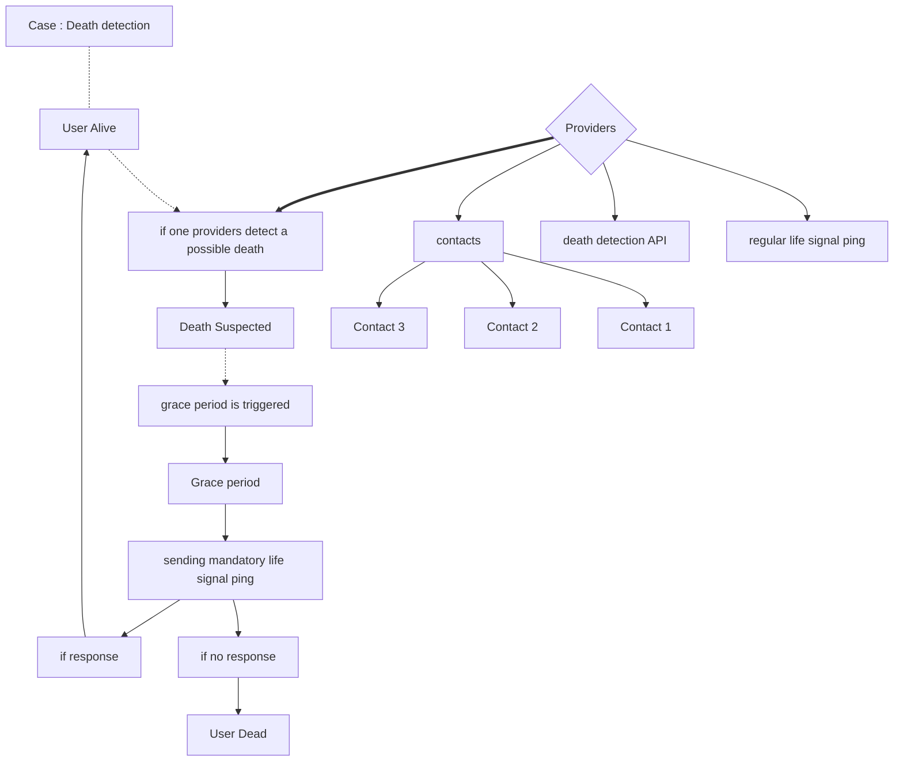
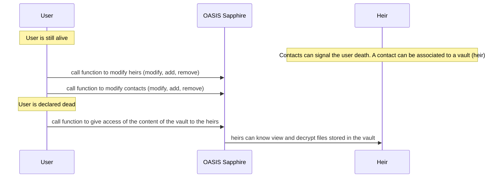
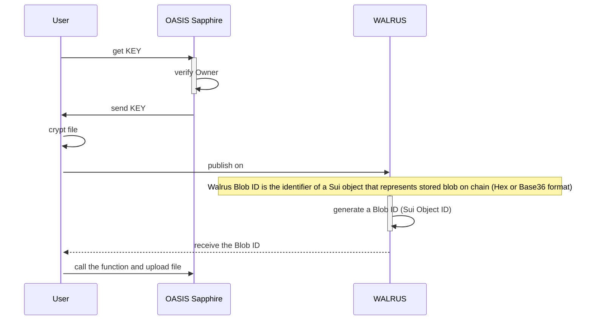
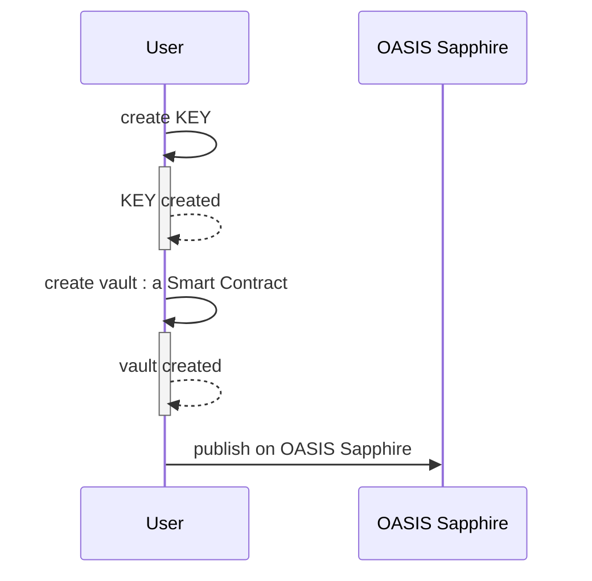

# 🪦 LifeSignal – ETHGlobal Hackathon Submission

**What happens to your digital legacy when you’re gone?**  
Our project brings secured inheritance to Web3 by creating a secure, decentralized, and privacy-preserving system to transfer sensitive data to loved ones in the event of death – no lawyers, no third parties, no spooky séances.

---

## 🔑 TL;DR

- Create a **vault** to store a decryption key.
- Encrypt your sensitive files (e.g. secrets, credentials, legal docs).
- Store them securely on **Walrus**, a decentralized cold-storage system.
- Check if your are dead from providers : life ping, contact, government API. In this current state for the project, use only vote consensus from contacts to validate the death.
- If you are dead, your **vault becomes accessible to your heirs**.
- Built using **Oasis Sapphire** for confidentiality and **Walrus** for durable, privacy-respecting file storage.

---

## 🧩 Why It Matters

### ✅ Public Good

Inheritance isn't just for whales. Everyday users, developers, DAOs, and creators need a secure, trustless way to pass on access to their digital lives. Our platform is censorship-resistant, borderless, and requires no legal intermediaries.

### 🕵️ Privacy & Security

- **Oasis Sapphire** ensures that even on-chain, sensitive data (like encryption keys) stays private.
- **Files are stored encrypted** off-chain on **Walrus**, preventing unauthorized reads and reducing on-chain bloat.
- Only pre-defined heirs can access secrets, **and only if the original owner becomes inactive**.

### 🧠 Data Availability

- Using **Walrus** ensures long-term storage and high availability of encrypted files.
- Walrus is designed for cold storage: cheaper, more resilient than IPFS, and with better read/write performance.

---

## ⚙️ How It Works

### 🛠 Functionality Overview

| Feature                        | Status       | Description                                                                 |
|--------------------------------|--------------|-----------------------------------------------------------------------------|
| Create Vault                   | ✅ Implemented | User deploys a smart contract vault to hold their encrypted key             |
| Upload Encrypted File to Walrus| ✅ Implemented | Frontend allows users to encrypt and upload files                           |
| Designate Heirs                | ✅ Implemented | Specify one or more Ethereum addresses who can unlock the vault             |
| Designate Contacts                | ✅ Implemented | Specify one or more Ethereum addresses who can vote the death             |
| Life Ping                      | ❌ Not implemented | User need to respond to regular life signals to prove they are still alive (or grace period)                      |
| Chainlink Automation Trigger   | ❌ Not implemented | Chainlink Automation flags inactivity (hosted on Sepolia)                   |
---

### 👤 Use cases

**Death detection - How to know if user (owner of the vault) is dead** 

In the current project, we using vote consensus from contact to validate the death of the owner. In the future, we are planning to use other providers like governement API or regular 'life signal' ping. To assure security (to not declare an alive person dead) we use a mandatory ping during the grace period, after the death is suspected from one of the providers.

**What append when the user (owner of the vault) is declared dead ?** 

When the user (owner of the vault) passed away and is declared dead, a function in the smart contract is triggered to release the vault to the heirs.

**File Upload - Using WALRUS to store encrypted file**

User use the key stored securely in the smart contract thank to OASIS Sapphire, to encrypt files. Files are uploaded on WALRUS, a decentralized file storage service.

**Creation of the vault**

The user create the vault, the key is stored in a decentralized blockchain (OASIS Sapphire) to ensure availability and security. This key will be used to encrypt files inside the vault.

## 🧪 Tech Stack & Architecture

| Layer                | Technology         | Why we chose it                                                                 |
|---------------------|--------------------|----------------------------------------------------------------------------------|
| Smart Contracts      | Solidity (Hardhat 2) | Reliable, customizable smart contracts                                          |
| Privacy Layer        | **Oasis Sapphire** | Confidential EVM: on-chain data can remain private (e.g., decryption keys)      |
| File Storage         | **Walrus**         | Optimized for cold, encrypted storage with better UX than IPFS                  |
| Frontend             | Next.js + Tailwind + Ethers.js | Web3-native, reactive UI with wallet integration                         |
| Deployment & Test    | Hardhat + Ignition | Modular, scriptable contract deployment and testing                             |

---

## 🧠 Why These Technologies?

- **Oasis Sapphire** is one of the only blockchains offering **confidential smart contracts**, ideal for our use case where privacy is *not optional*.
- **Walrus** offers decentralized, low-cost cold storage with better read/write ergonomics and availability than IPFS — perfect for sensitive data that might remain untouched for years.

---

## 🪦 Final Words

In crypto, we like to say **“don’t trust, verify.”**  
Now you can **inherit** securely — and trustless-ly.

**Your secrets may die with you. But now, they don't have to.**

